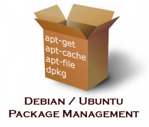

# Linux Boot

## Package Managers

https://en.wikipedia.org/wiki/List_of_software_package_management_systems

*  [Debian Package](https://doc.ubuntu-fr.org/dpkg)

# Reference:

[./.md]

### virbr0
http://www.cyberciti.biz/faq/linux-kvm-disable-virbr0-nat-interface/

