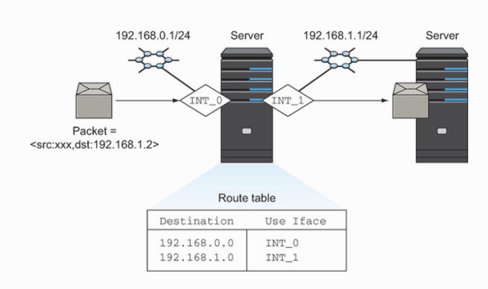

## Neutron

## [0.KVM](./0.KVM)

### [1.Bridging](./1.Bridging)

### [2.OpenVswitch](./2.Open-vSwitch)

### [3.NetNS](./3.NetNS)

# References:

## Networking

hub vs Bridge vs Switch
https://www.youtube.com/watch?v=Xmwmezk75Tk

