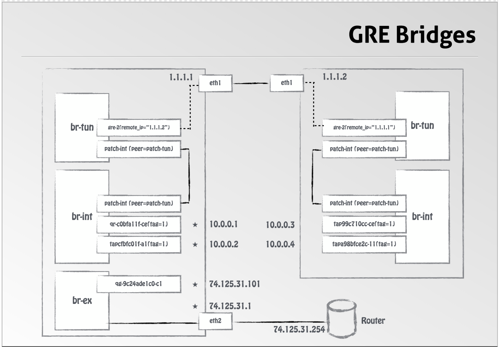

## Neutron

## KVM

### [Bridging](./1.Bridging)

### [OpenVswitch](./2.Open-vSwitch)

### [NetNS](./3.NetNS)

# References:

## Networking

hub vs Bridge vs Switch
https://www.youtube.com/watch?v=Xmwmezk75Tk

